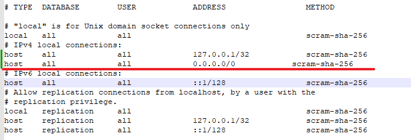
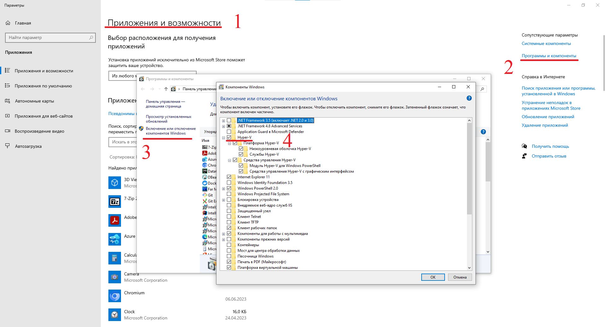
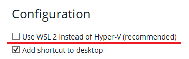

# Руководство по развертыванию приложения Pro-Legacy

Это руководство поможет вам развернуть приложение **ProLegacy Lab** с использованием Docker. Приложение состоит из трёх
основных компонентов: Java-сервиса, веб-приложения и Java-сервиса для интеграции со стендами, не поддерживающих
REST-API. Java-service и Java-сервиса для интеграции разработаны на языке **Java 17** с использованием
фреймворка **Spring Boot 3**. Веб-приложение разработано при помощи фреймворка **Angular 17**. Также в процесс
развертывания включено создание контейнера с СУБД PostgreSQL.

Данное руководство содержит инструкцию развёртке приложения со сборкой из исходных файлов, а также без сборки, из
предоставляемых нами при поставке образов Docker изображений.

---

## Предварительные требования

- Установленный Docker на вашей системе
- Стабильное подключение к интернету
- В случае использования внешней базы данных:
    - рекомендуемая версия PostgreSQL последняя LTS - 16.2
    - база данных должна быть настроена должна быть настроена для принятия соединений от сторонниих устройств в
      локальной сети.
- База данных с интеграционной таблицей для ПО для управления стендами, не поддерживающими REST API, должна быть
  настроена для принятия соединений от сторонниих устройств в локальной сети. Также, в ней должен быть определён
  пользователь, имеющий права чтения/записи в таблицу `migration.thermo` и права чтения из
  таблиц `dictionaries.personal` и `dictionaries.product`.

---

## Настройка базы данных для принятия соединений от сторонниих устройств в локальной сети

Чтобы открыть базу данных PostgreSQL для соединения от сторонниих устройств в локальной сети, необходимо добавить в
файл `pg_hba.conf` следующую строку:

```
host all all 0.0.0.0/0 scram-sha-256
```

В результате файл должен выглядеть примерно так:



Если, при этом, сервис PostgreSQL был запущен, необходимо перезапустить его, введя последовательно следующие команды:

**Windows**

```bash
net stop postgresql-x64-<version>
net start postgresql-x64-<version>
```

**Linux**

```bash
sudo service restart postgresql 
```

---

## Рекомендации по установке Docker на Windows 10

На Windows 10 настоятельно рекомендуется использовать Hyper-V вместо WLS.

1. Чтобы включить Hyper-V, необходимо поставить галочку
   напротив соответствующего пунка, как это показано на скриншоте.

   

2. Во время установки Docker Desktop необходимо выбрать соответсвующую настройку

   

---

## Состав поставки

В архиве поставки содержатся:

- Папка `atom-2024-backend`, содержащая исходный код Java-сервиса
- Папка `atom-2024-front`, содержащая исходный код веб-приложения
- Папка `atom-2024-integration-service`, содержащая исходный код итеграционного приложения
- Архив `images.tar`, содержащий готовые docker-образы Java-сервиса и веб-приложения
- Файл `docker-compose.yml`, содержащий конфигурацию развертывания
- Скрипты `run_from_images.bat` и `run_from_images.sh`, разворачивающие приложение из образов Docker изображений
  соответственно под Windows или Linux

---

## Шаг 0: Конфигурация

Если вам нужно настроить какие-либо переменные среды или параметры конфигурации, вы можете изменить
файл `docker-compose.yml` соответственно.

Обязательные для заполнения параметры:

- **rest:**
    - **spring.datasource.url**: Определяет URL для подключения к базе данных. Значение по
      умолчанию: `jdbc:postgresql://postgres:5432/postgres`.
    - **spring.jpa.properties.hibernate.default_schema**: Задает схему базы данных, используемую Hibernate. Значение по
      умолчанию: `public`.
    - **spring.datasource.username**: Определяет имя пользователя для подключения к базе данных. Значение по
      умолчанию: `postgres`.
    - **spring.datasource.password**: Устанавливает пароль для подключения к базе данных. Значение по
      умолчанию: `postgres`.
    - Группа параметров для конфигурации базового администратора:
        - **default-user.email**: Важно, чтобы email-адресс был реальным - на него будут приходить уведомления.
        - **default-user.password**
        - **default-user.firstname**
        - **default-user.lastname**
        - **default-user.surname**
    - **stands.json**: json, описывающий интегрируемые ПО управления стендами. Подробное описание правил заполнения
      будет дано ниже.
- **web:**
    - **baseUrl**: Определяет базовый URL, используемый фронтендом для взаимодействия с бэкэндом. Значение по
      умолчанию: `http://localhost:8085`.
- **integration**:
    - **spring.datasource.url**: Определяет URL для подключения к базе данных с интеграционной таблицей. Значение по
      умолчанию: `jdbc:postgresql://<ip устройства, на котором поднята база>:5433/nwd-atomskills-2024`.
    - **spring.datasource.username**: Определяет имя пользователя для подключения к базе данных. Значение по
      умолчанию: `sys`.
    - **spring.datasource.password**: Устанавливает пароль для подключения к базе данных. Значение по
      умолчанию: `postgres`.
- **postgres:**
    - **POSTGRES_USER**: Определяет имя пользователя для доступа к базе данных PostgreSQL. Значение по
      умолчанию: `postgres`.
    - **POSTGRES_PASSWORD**: Устанавливает пароль для пользователя базы данных PostgreSQL. Значение по
      умолчанию: `postgres`.
    - **POSTGRES_DB**: Определяет имя базы данных, которая будет создана по умолчанию при запуске контейнера PostgreSQL.
      Значение по умолчанию: `postgres`.

В случае использования нашей базы данных:

- Важно, пользователь указанный в настройке **rest** должен совпадать с пользователем указанным в конфиге **postgres**.
- Подключение к СУБД осуществляется по
  адресу `jdbc:postgresql://localhost:<порт указанный в конфиге postgres>/<POSTGRES_DB>`. По умолчанию адрес
  будет  `jdbc:postgresql://localhost:5496/postgres`.
- Информацию о дополнительной настройке контейнера postgres можно найти на странице официального Docker-образа postgres
  на
  сайте DockerHub: `https://hub.docker.com/_/postgres`.

В случае использования внешней базы данных:

- Необходимо удалить из docker-compose строки, касающиеся сервиса postgres (все
  строки после `postgres:` включительно, отмечено комментарием).
- Необходимо предварительно создать схему, указанную в
  параметре `rest.spring.jpa.properties.hibernate.default_schema`.
- Необходимо предварительно создать и сконфигурировать пользователя, указанного в параметах **rest**.

Для изменения порта Java-сервиса, веб-приложения или СУБД, необходимо изменить настройку `ports:` соответствующего
сервиса, изменяя первое значение на необходимый вам порт. Например, для изменения порта веб-приложения на 4200
необходимо произвести следующее изменение: `4963:80 -> 4200:80`. Изменять второе значение запрещено.

---

## Описание параметра `stands.json`

В общем виде json, содержащийся в данном поле должен иметь вид:

```
[{
    "name": string                                          - Наименование ПО управления стендами, уникальное
    "description"?: string                                  - Описание ПО управления стендами
    "url": string                                           - Базовый URL REST API ПО управления стендами
    "endPoints": [{                                         - Список элементов API, отвечающих за конкретные испытания
        "name": string                                      - Наименование испытания, за которое отвечает элемент API, уникальное
        "description"?: string                              - Описание испытания, за которое отвечает элемент API
        "url": string                                       - URL для передачи информации об испытании, за которое отвечает элемент API
        "standEndpointType": {
            "inMeta": {                                     - Описание формата входных данных для передачи при создании испытания
                "fields": {                                 - Объект, ключи которого являются названиями входных параметров, а значения - описание этих параметров 
                    [key: string]: {                        - Техническое наименование поля
                        "label": string                     - Наименование поля в локализованном (русифицированном виде)
                        "nodeType": enum MetadataNodeType   - Тип значения поля
                    }
                }
            }
            "outMeta": {...}                                - Описание формата выходных данных, получаемых при завершении испытания
        }
    }]
}]
```

Возможные значения перечисления MetadataNodeType:

```
    "STRING",                 - строка
    "BOOLEAN",                - булевый тип 
    "NUMBER",                 - число (целочисленное или дробное)
    "DATE",                   - дата без времени
    "INSTANT",                - дата и время в часовом поясе UTC
    "RESULT_ENUM",            - перечисление признака окончания испытания
    "SAMPLE_TYPE_ENUM"        - перечисление типа образца
```

Файл docker-compose.yml, присутствующий в поставке содержит правильно сконфигурированный json, которому требуется лишь
небольшая доконфигурация.

### Важно!

Для корректного развертывания приложения с интеграцией одного environment-сервиса необходимо поменять в `stands.json`
все url соответственно развернутому environment-сервису. В частности, в каждом параметре url должен быть изменён ip со
значения localhost на ip, соответствующий компьютеру, на котором развернут environment-сервис. Также, необходимо
провалидировать, что порты в url соответствуют текущим настройкам environment-сервиса.

#### Исключение: сервис, работающий с Термобарокамерой - его url менять не надо.

Пример изменения url:
`url: "http://localhost:1060/test/curve" -> url: "http://172.30.8.123:1060/test/curve"`

### Интеграция с несколькими environment-сервисами

Для интеграции с двумя и более environment-сервисами необходимо скопировать объект корневого массива нужное число раз,
чтобы число элементов корневого массива совпадало с числом environment-сервисов. Далее необходимо в каждом элементе
массива правильно настроить все url-поля в соответствии с развернутыми environment-сервисами и изменить поля "name"(они
должны быть уникальными). Также необходимо раскопировать строки настройки integration-сервиса в docker-compose.yml,
настроив для каждого из инстансов подключение к БД и изменив имена сервисов для соблюдения уникальности. Имена сервисов
затем следует подставить вместо ip в параметры url Термобарокамеры.

---

## Шаг 1: Сборка и запуск Docker-контейнеров

### Использование готовых Docker-образов

Откройте терминал (cmd/powershell и т.д.) и перейдите в папку поставки.
Выполните следующую команду для загрузки готовых Docker-образов в локальный репозиторий и запуска
соответствующих контейнеров.

**Windows**

```bash
run_from_images.bat
```

**Linux**

```bash
./run_from_images.sh
```

Не закрывайте консоль до окончания работы с приложением.

### Сборка из исходных файлов

Откройте терминал перейдите в папку поставки и выполните следующую команду для сборки и запуска Docker-контейнеров.

```bash
docker-compose up
```

Это соберет Docker-образы Java-сервиса и веб-приложения из исходного кода и развернет соответствующие контейнеры.
Не закрывайте консоль до окончания работы с приложением.
---

## Шаг 2: Доступ к приложению

После запуска контейнеров вы сможете получить доступ к приложению Pro-Legacy с помощью вашего веб-браузера по
адресу `http://localhost:<порт указанный в конфиге web>`. По умолчанию адрес будет  `http://localhost:4963`.

---

## Шаг 3: Остановка приложения

Чтобы остановить приложение и завершить работу контейнеров, закройте терминал или используйте сочитание CTRL+C.

---
