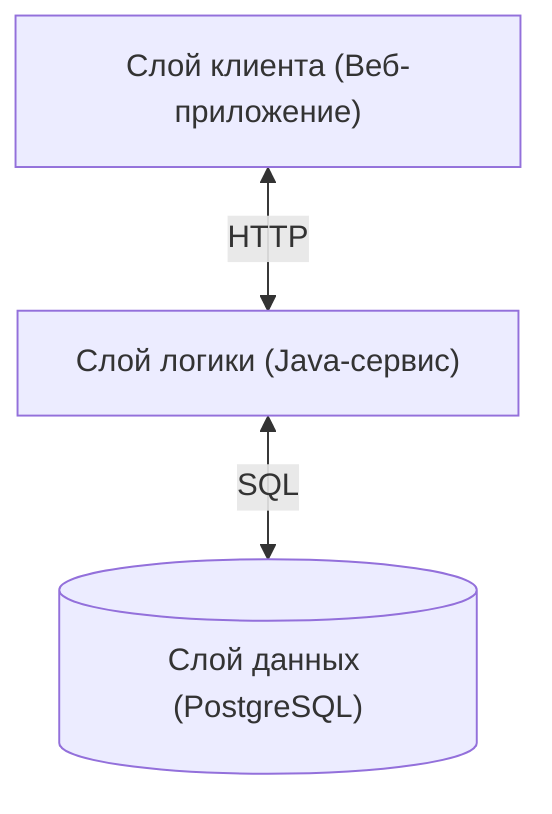
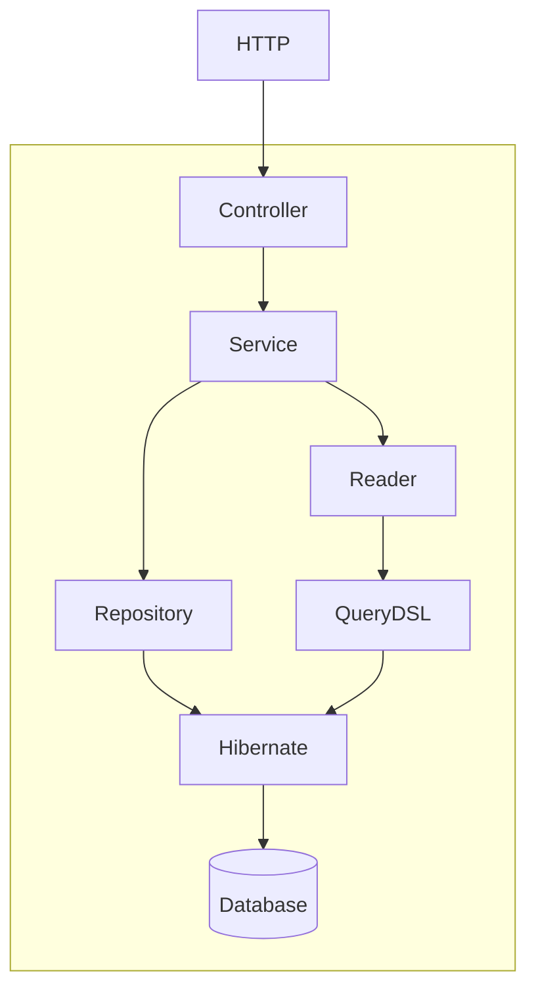
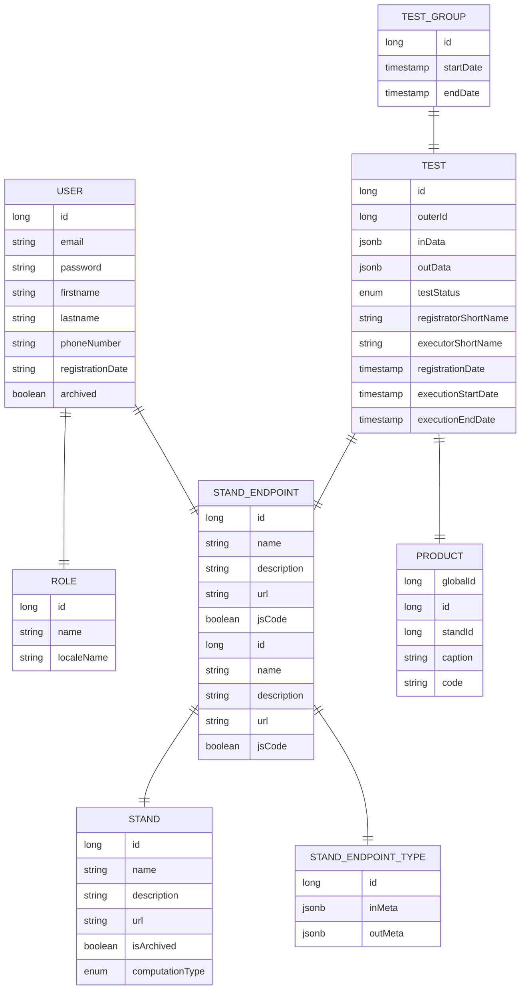
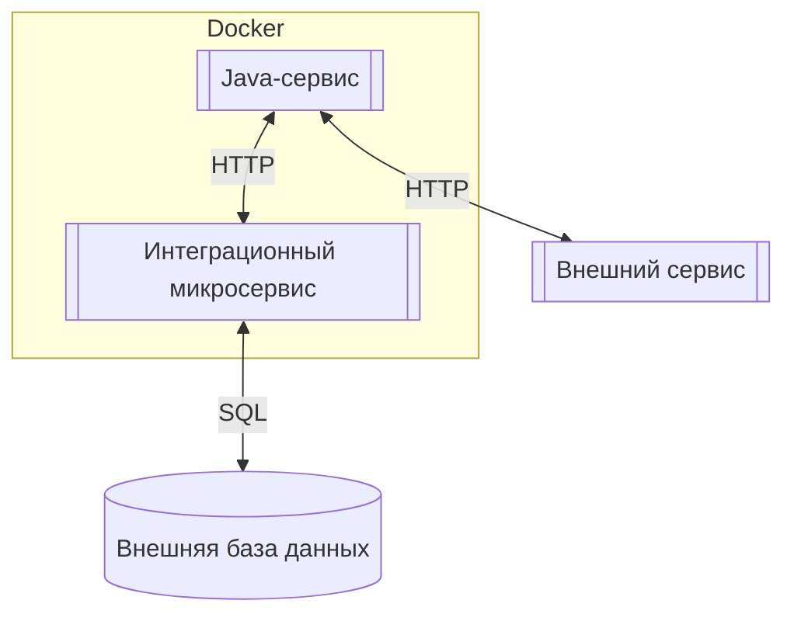
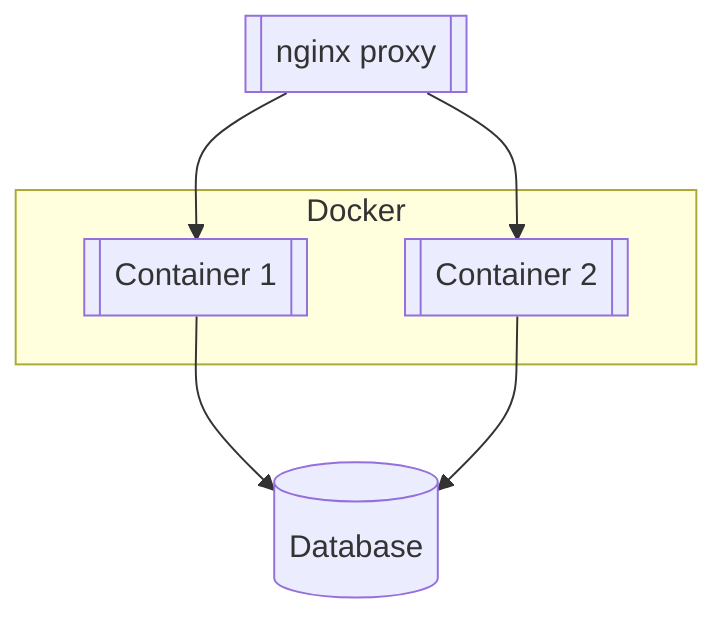

# Техническое описание системы

Система **ProLegacy Lab** разработана в соответствии с трёхзвенной архитектурой:

- Слой клиента представляет собой веб-приложение, разработанное при помощи фреймворка **Angular 17**
- Слой логики представляет собой сервис, написанный на языке **Java 17** с использованием фреймворка **Spring Boot 3**
- Слой данных представляет собой СУБД PostgreSQL

Для каждого слоя были выбраны решения с открытым исходным кодом и свободной лицензией. Выбор также обусловлен
стремлением обеспечить максимальную кроссплатформенность системы. Так, для доступа к веб-приложению клиенту необходим
только веб-браузер, что позволяет использовать его практически на любом устройстве, включая смартфоны, планшеты и т.д.
Использование Java в качестве языка программирования позволяет развернуть сервис на любой платформе, поддерживающей
виртуальную машину Java.
Схема взаимодействия между слоями представлена ниже:

Веб-приложение взаимодействует с Java-сервисом посредством HTTP-протокола. Для доступа Java-сервиса к базе данных
PostreSQL используется SQL.

---

## Описание Java-сервиса

Слой логики представляет собой сервис, написанный на языке **Java 17** с использованием фреймворка **Spring Boot 3**.
Выбор Java обусловлен её кроссплатформенностью, а также тем, что вокруг Java сформировалось обширное сообщество
разработчиков и богатая экосистема инструментов и библиотек, что облегчает разработку и поддержку приложений. Spring
Boot является одним из наиболее популярных фреймворков для разработки приложений на Java. Он предоставляет множество
готовых компонентов для быстрой разработки приложений, включая поддержку микросервисной архитектуры, безопасности,
работу с базами данных и многое другое. Кроме того, Java и Spring Boot известны своей долгосрочной поддержкой, что важно
для корпоративных приложений, поскольку они обычно имеют длительный жизненный цикл и требуют регулярного обновления и
поддержки.

Вся бизнес-логика системы сосредоточена на уровне Java-сервиса. Взаимодействие с Java-сервисом осуществляется с помощью
REST API посредством протокола HTTP. Для взаимодействия с базой данных используется библиотека объектно-реляционного
преобразования Hibernate, которая позволяет работать с базой данных в терминах Java-классов, а не таблиц данных.
Hibernate представляет свой объектно-ориентированный язык запросов - HQL, на основе которого генерируется SQL запрос,
передаваемый непосредственно в базу данных. Для написания запросов к базе данных также используется библиотека QueryDSL,
упрощающая создание HQL-запросов и обработку их результатов.

Общая логика работы Java-сервиса представлена на следующей схеме.

Внешний запрос поступает по HTTP и обрабатывается классом типа "Controller". Для обработки запроса в соответствии с
бизнес-логикой Controller вызывает класс типа "Service". Service использует класс типа "Repository" для чтения и
изменения сущностей приложения, который в свою очередь генерирует HQL-запросы для их обработки Hibernate. Класс типа "
Reader" используется Service для чтения объектов возврата клиенту. Reader использует QueryDSL для генерации HQL-запросов
для их обработки Hibernate. Hibernate обеспечивает преобразование HQL-запросов в SQL-запросы и непосредственное
взаимодействие с базой данных.

---

## Описание веб-приложения

Клиентское веб-приложение представляется собой Single Page Application (SPA), которое разработано с помощью фреймворка *
*Angular 17**. Angular - это популярный фреймворк для разработки веб-приложений, разработанный и поддерживаемый командой
Google. Angular использует язык TypeScript и принцип компонентной архитектуры, что делает код более читаемым,
масштабируемым, а также обеспечивает модульность. Angular является проектом с открытым исходным кодом и имеет свободную
лицензию.

В качестве библиотеки компонентов пользовательского интерфейса используется библиотека PrimeNG, разработанная компанией
PrimeTek Informatics. Она предоставляет широкий спектр готовых компонентов, таких как таблицы данных, формы, кнопки,
меню, диалоговые окна и многое другое. В проекте используется версия PrimeNG Community Edition - проект с открытым
исходным кодом, распространяемый под свободной лицензией.

---

## Описание СУБД

Данная система работает с помощью СУБД PostgreSQL.

Структура данных разработана на основе ER-диаграммы представленной ниже.

---

## Описание внешних интеграций

Общая схема интеграции с внешними системами представлена ниже:

Стандартная интеграция с внешним сервисом происходит через REST API посредством HTTP-запросов.

В случае, если внешняя система не имеет возможности предоставить REST API (например, если она представляет собой базу
данных), предполагается развертывание интеграционного микросервиса. Интеграционный микросервис развертывается в
Docker-контейнере аналогично основному сервису и подключается к внешней базе данных. Далее, взаимодействие между
основным сервисом и интеграционным микросервисом происходит по REST API посредством HTTP-запросов.

---

## Масштабирование

Серверная часть приложения **ProLegacy Lab** представляет собой Java-сервис, разработанный с помощью технологии Spring
Boot. Рекомендуемым способом развертывания Java-сервиса является развертывание в Docker-контейнере. Использование Docker
позволяет легко реализовать горизонтальное масштабирование путём развертывания дополнительных контейнеров. Таким
образом, в случае, если основной контейнер приложения испытывает значительную загрузку, можно просто развернуть
дополнительный контейнер, подключенный к той же базе данных, и перенаправить на него часть запросов. Для организации
доступа к нужному контейнеру предлагается использование nginx, который может выступать в качестве proxy.

Такой подход, однако, имеет недостаток в виде необходимости полу-ручного управления процессами развертывания,
масштабирования и обновления. Более продвинутым подходом является использование технологий оркестрации Docker таких как
Kubernetes или Docker Swarm. При помощи этих технологий можно поднять несколько узлов c Docker и оркестрировать
контейнеры между узлами. Это позволит автоматизировать процессы управления контейнерами.

В случае, если значительную загрузку будет испытывать не Java-сервис, а база данных, то целесообразно использовать
технологии репликации. Можно распределить нагрузку, расположив инстансы базы данных на нескольких серверах. Один инстанс
будет использоваться для записи данных, а все прочие - для чтения. При изменении инстанса для записи, прочие инстансы (
реплики) будут своевременно синхронизированы. Если применения технологий репликации будет недостаточно, то имеет смысл
прибегнуть к технологиям шардирования.

По мере роста инфраструктуры и требований к производительности может потребоваться увеличение мощностей. Соответственно,
может потребоватьcя увеличение мощностей за счет увеличения ресурсов: процессоров, оперативной и постоянной памяти(SSD,
HDD).

---