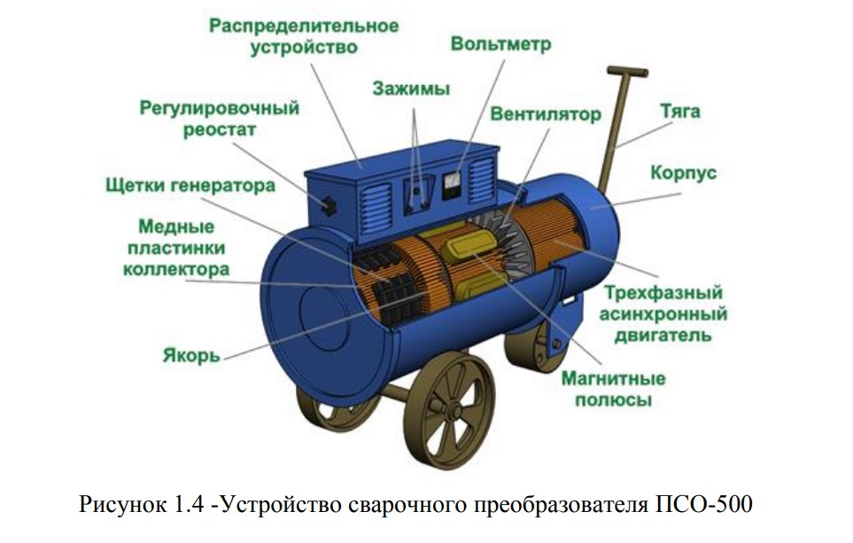
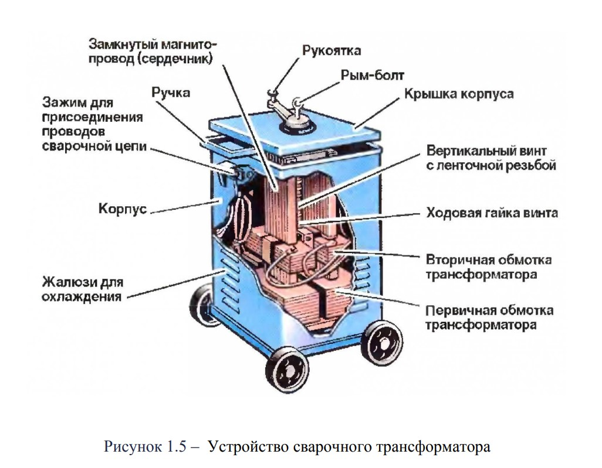
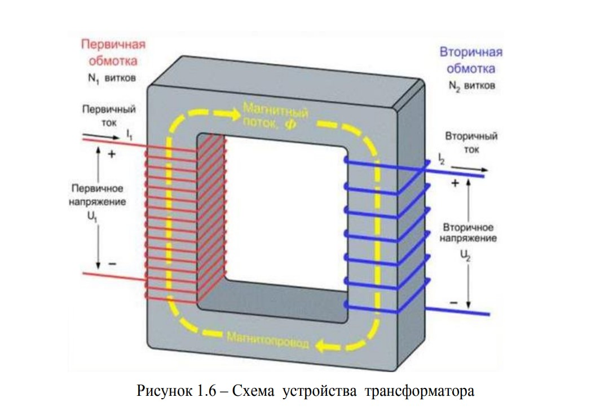

# ОБЩИЕ СВЕДЕНИЯ О СВАРКЕ ## Основы электрической дуговой сварки плавлением ### Цель изучения дисциплины  Целью настоящего учебного курса, составленного в соответствии с программой учебной дисциплины «Сварочное производство», разработанного в соответствии с требованиями Федерального государственного образовательного стандарта – научить студентов теоретическим основам сварки различными способами и практическому применению полученных знаний. ### Сущность образования сварного соединения 
*Электрическая сварочная
дуга* представляет собой устойчивый длительный электрический разряд в газовой среде между твердыми или жидкими электродами, находящимися под напряжением, сопровождающийся выделением большого количества теплоты. Электрический разряд в газе есть электрический ток, проходящий через газовую среду благодаря наличию в ней свободных электронов, а также отрицательных и положительных ионов, способных перемещаться между электродами под действием приложенного электрического поля (разности потенциалов между электродами).  Условия
*зажигания* и
*горения* дуги. Сварочная дуга должна иметь определенные технологические условия, обеспечивающие ее быстрое зажигание, устойчивое горение, малую чувствительность к изменениям ее длины в определенных пределах, быстрое повторное зажигание (возбуждение) после обрыва, необходимое проплавление основного металла.  Условия зажигания и устойчивого горения дуги зависят от таких факторов, как состав обмазки при сварке штучными электродами, род тока (постоянный или переменный), прямая или обратная полярность при сварке на постоянном токе, диаметр электрода, температура окружающей среды.  Для зажигания дуги требуется напряжение большее по величине, чем напряжение для горения дуги. Напряжение, подводимое от источника питания к электродам при разомкнутой сварочной цепи, является напряжением холостого хода. При сварке на постоянном токе напряжение холостого хода не превышает 90 В, а на переменном токе – 80 В. В момент горения дуги напряжение, подаваемое от источника питания, значительно снижается и достигает величины, необходимой для устойчивого горения дуги. В процессе горения дуги ток и напряжение находятся в определенной зависимости.  ` `Зависимость напряжения дуги от тока в сварочной цепи, при условии неизменной длины дуги, именуют статической вольт-амперной характеристикой дуги.   Первым условием зажигания и горения дуги является наличие источника питания дуги достаточной мощности, позволяющего стремительно нагревать катод до высочайшей температуры при возбуждении дуги. Более полная стабилизация горения дуги достигается также при достаточной степени ионизации столба дуги, потому вторым условием для зажигания и горения дуги является наличие ионизации столба дуги за счет введения в состав покрытия штучных электродов либо в состав флюсов таких частей, как алюминий, натрий, барий, калий, литий, кальций и др. Эти элементы владеют низким потенциалом ионизации и в момент зажигания дуги содействуют резвому ее возникновению. Третьим условием стойкости горения дуги при сварке на переменном токе является наличие в сварочной цепи дросселя (завышенной индуктивности). Это разъясняется тем, что в сварочной цепи переменного тока, имеющей только омическое сопротивление, в процессе горения дуги образуются обрывы (100 обрывов дуги за секунду при промышленной частоте переменного тока 50 Гц).  При замыкании накоротко сварочной цепи получают раскаленный конец электрода, при этом в силу вступает закон Джоуля-Ленца. Выделяемое количество тепла достаточно для мгновенного расплавления конца электрода. Часть металла на конце электрода превращается в пар. При отрыве конца электрода от изделия атомы приходят в возбужденное состояние и с их крайних орбит срываются электроны проводимости.  
*Электрон* — это частица весьма малой массы, несущая элементарный (наименьший, неделимый) электрический заряд отрицательного знака. Масса электрона равна 9,1·10-28 г; элементарный электрический заряд равен 1,6·10-19 Кл.  
*Ионом* называется атом или молекула вещества, имеющая один или несколько элементарных зарядов. *Положительные
ионы* имеют избыточный положительный заряд; они образуются при потере нейтральным атомом или молекулой одного или нескольких электронов из своей наружной (валентной) оболочки (электроны, вращающиеся в валентной оболочке атома, связаны слабее, чем электроны внутренних оболочек, и поэтому легко отрываются от атома при столкновениях или под действием облучения).
*Отрицательные
ионы* имеют избыточный отрицательный заряд; они образуются, если атом или молекула присоединяет к своей валентной оболочке лишние электроны.  Процесс, при котором из нейтральных атомов и молекул образуются положительные и отрицательные ионы, называется
*ионизацией*, а воздушный дуговой промежуток будет ионизированным. Ионизированный воздушный дуговой промежуток – плазма проводящая ток. Ионизация, вызванная в некотором объеме газовой среды, называется объемной ионизацией.
*Объемная ионизация*, полученная благодаря нагреванию газа до очень высоких температур, называется *термической
ионизацией*.  Процесс ионизации газа наглядно показан на рисунке 1.1, на котором ясно видно, что в результате бомбардировки электрически нейтральных атомов газа (А, А') быстрыми электронами (Э1, Э2), испускаемыми катодом (это явление называется эмиссией электронов), первые теряют один или несколько электронов. При этом их скорость уменьшается, но они продолжают движение к аноду под воздействием его электрического поля. А атомы вместе с электронами, утратившими часть электричества, превращаются в положительно заряженные ионы (+И), которые начинают перемещаться к катоду. При столкновении с ним положительные ионы выбивают из него электроны и частично захватывают их, становясь нейтральными атомами, а остальные электроны движутся к аноду. Отрицательно заряженные ионы (-И) появляются тогда, когда атомы захватывают свободные электроны. Поскольку не все элементы способны на это, отрицательных ионов в ионизированном газе, как правило, меньше, чем положительных.  Описанный процесс, в ходе которого в среде газа или пара образуются положительно и отрицательно заряженные частицы, называется
*объемной
ионизацией*. Кстати, она возможна не только от соударения частиц, ее причиной может быть энергия светового излучения. Кроме того, ионизация газа или пара происходит при их нагревании до температуры 2000 °C (
*термическая
ионизация*), когда повышается скорость движения частиц и возрастает число их столкновений. Положительные ионы могут образоваться из атомов всех элементов, а отрицательные – не из всех. Легче всего отрицательные ионы образуют галоиды, кислород, щелочные элементы.  Пары этих элементов, находясь в дуговом промежутке, обеспечивают легкость возбуждения и устойчивое горение дуги. Это свойство щелочных металлов объясняется тем, что атомы этих элементов (К, Na, Ва, Li) обладают наименьшим потенциалом ионизации. Поэтому для повышения устойчивости горения электрической дуги эти вещества вводят в зону дуги в виде электродных окрытий или флюсов.    Таким образом, электропроводность воздушного промежутка между электродами, а отсюда и устойчивое горение дуги обеспечивается эмиссией катода и объемной ионизацией газов в зоне дуги, благодаря которым в дуге этих металлов обладают малым потенциалом ионизации. Возникновение сварочной дуги происходит в несколько этапов (рисунок 1.2).    Строение сварочной дуги показано на рисунке 1.3.    Введение этих элементов в обмазку электродов способствует большему образованию большого количества заряженных частиц, следовательно легче зажигать дугу.  
*Обмазка электродов способствует легкому зажиганию дуги и устойчивому ее
горения.* ## Источники питания сварочной дуги  ### Основные требования, предъявляемые к источникам питания сварочной дуги  К источникам питания предъявляются следующие требования:   1. Внешняя характеристика источника питания должна соответствовать статической (вольтамперной) характеристике дуги. 1. Напряжение холостого хода должно быть достаточным для легкого зажигания дуги, но не превышающим нормы техники безопасности. Величина напряжения холостого хода зависит от конструкции и назначения сварочного агрегата и составляет (60 ÷ 80) В. 1. Источник должен обладать хорошими динамическими свойствами. С увеличением длины дуги рабочее напряжение должно быстро возрастать, а с уменьшением - быстро падать. Время восстановления рабочего напряжения при 12 коротком замыкании от 0 до 30 В не должно превышать 0,05 с, а по требованиям минимального разбрызгивания металла - 0,01-0,02 с. 1. Ток короткого замыкания не должен быть чрезмерно велик во избежание перегрева электрода, оплавления покрытия и разбрызгивания металла, но не должен быть и слишком мал, чтобы не затруднять повторное зажигание дуги. Поэтому для источников сварочного тока принято следующее соотношение между током короткого замыкания и рабочим током: 1. Мощность источника сварочного тока должна быть достаточной для выполнения сварочных работ соответствующим способом. 1. Источник должен иметь устройство для плавного регулирования силы тока. ### Сварочные преобразователи постоянного тока и выпрямители. Сварочные трансформаторы ####
*Сварочные
преобразователи* Что такое сварочный преобразователь: его строение и назначение?   Разновидностью источника рабочего тока считается сварочный преобразователь, объединяющий в одном корпусе электродвигатель, генератор и выпрямитель. Такая установка используется при проведении строительномонтажных работ, когда электросеть провисает и другие сварочные аппараты работают нестабильно. Сварка преобразователем проводится током в пределах 500 ампер, можно варить толстые заготовки, формировать сварочный шов от 10 до 30 мм глубиной. Преобразователь меняет напряжение, тип токовых характеристик.   
*Устройство.*   Детально рассмотреть устройство оборудования можно на примере стационарного сварочного преобразователя ПСО 500 (рисунок 1.4), выдающего два рабочих режима с максимальными токовыми характеристиками 300 или 500 ампер. Между ротором электромотора и якорем генератора, расположенными на одном валу, размещен вентилятор с крыльчаткой, обеспечивающей направленное охлаждение контактной зоны, где большая сила трения. Подшипники размещены в корпусе преобразователя, он обязательно заземляется.     Катушечный якорь генератора с 4-мя независимыми обмотками соединен с коллектором, пластины выпрямителя подключены к концам якорных обмоток. При вращении катушек между полюсами магнитов, возникает электромагнитная индукция, наводится переменный ток. Для обмотки используют отожженную медную или алюминиевую проволоку – металлы с хорошей электропроводностью. Для защиты от внешних электромагнитных полей и вихревых, возникающих при работе преобразователя, предусмотрен «фильтр» – электроемкость (два конденсатора, стабилизирующие напряжение).   Блок управления у преобразователя модульный. Для запуска сварочного преобразователя вмонтирован пакетник. Рядом размещен амперметр, по которому определяют токовые параметры. Прибор подключен к реостату, регулирующему рабочие токовые показатели (измеряет ампераж в цепи независимой обмотки возбуждения).   После включения преобразователя важно проверять направление вращения обмоток генератора. При необходимости, запитывающие клеммы меняют 14 местами, чтобы ротор вращался против часовой стрелки. Для требуемой величины рабочего тока перемычка фиксируется в положении «300 А» или «500 А» (это максимальное значение генерируемого электротока).   
*Принцип
работы.*   Строение у всех видов сварочных преобразователей типовое:   - подводимый к асинхронному электродвигателю ток после включения установки преобразуется в механическую, которая подается на вал генератора;  - генератор выдает необходимую частотность токовых параметров, в работе использован метод электромагнитной индукции, на вал насажен якорь с обмотками;  - коллектор выполняет функцию выпрямителя, подает питание на выходные клеммы.   Сварочный преобразователь по сути – это комбинация электродвигателя, работающего от сети 220 или 380 В и генератора постоянного тока. Надежность преобразователя снижают вращающиеся узлы, велики энергопотери в процессе преобразования электротока.   Оборудование ценится за стабильность токовых характеристик вне зависимости от скачков подаваемого на двигатель напряжения. Регулятором рабочих характеристик является реостат, меняя число витков независимой обмотки изменяют ампераж. Выходной ток регулируется вручную по амперметру.  ####
*Сварочные
выпрямители*  Назначение сварочного выпрямителя сводится к тому, чтобы модулировать ток, исходящий от бытовой сети. На выходе он должен быть преобразован в постоянный ток с определенными параметрами. Основным показателем оборудования для сварочных работ является генерируемая сила тока, выраженная в Амперах. Данный показатель зависит от технических характеристик выпрямителя, который по своей сути является более совершенным трансформатором. Он не только способен модулировать электрический ток, но и выпрямить его.   Это основное отличие между сварочными аппаратами переменного и постоянного тока. Дополнительно (помимо выпрямителей) устройства оснащают конденсаторами и полупроводниковыми фильтрами, призванные нивелировать импульсы постоянного тока и сделать его равномерным. В соответствии с требованиями технологии выполнения сварочных работ применение выпрямителей целесообразней нежели трансформаторов. В этом случае более стабильной является дуга, а металл разбрызгивается намного меньше.   Устройство является преобразовательным блоком с возможностью регулировки силы тока (ампераж) и напряжения (вольтаж). На выходе сварочного выпрямителя есть провода с клеммами – плюсовой и минусовой. Один из них подключается к электроду, а другой контактирует с заготовкой. В результате замыкания цепи образуется электрическая дуга. Ее высокая температура позволяет расплавлять металлы и сваривать их.   В зависимости от назначения выпрямители отличаются уровнем сложности и функционалом. Тем не менее, принципиальная рабочая схема остается типовой. Его основу составляет преобразователь – трансформатор, модулирующий нужное для конкретной ситуации напряжение. Помимо этого, в схеме есть определенное количество полупроводников, которые отсекают отрицательную часть синусоиды переменного тока, пропуская только положительный заряд.   Ниже перечислены основные элементы, которые включаются в любую схему оборудования такого рода.   Сварочный выпрямитель состоит из:   - трансформатора – узла, позволяющего регулировать напряжение. Сетевой ток проходит через трансформатор и преобразуется. В результате снижается силовая нагрузка;  - блока выпрямления, который состоит из набора полупроводников, преобразующий переменный ток в постоянный;  - регуляторов частотности и силы тока;  - накопителей – сглаживают импульсы.  Чтобы разобраться в принципе работы оборудования, необходимо обратить внимание на механику работы полупроводников. Они открыты для прохождения электродов исключительно в положительном полупериоде. При условии, что схема содержит несколько полупроводников генерируется соответствующее количество полупериодных кривых. Они накладываются друг на друга, образуя постоянное напряжение.   Сварочные выпрямители применяются в работе при прямой и обратной полярности, с низкими и высокими токами. При выборе силовых параметров учитывается толщина заготовки, пластичность и тугоплавкость материала.  Устройства подходят для подключения:   - тугоплавких вольфрамовых электродов;  - легкоплавных угольных расходников;  - насадок автоматов и полуавтоматов.   Основные типы сварочных выпрямителей   Преобразователи сварочного тока отличаются по двум показателям: типу конструкции и способу регулировки силовых показателей подключения.   Основные виды выпрямителей:   -регулировка осуществляется посредством изменений в работе трансформатора;   -модели с дросселем. Используется индукционная катушка, исключающая резкие перепады напряжения;   -тиристорные. В качестве регуляторов, изменяющих напряжение, используются тиристоры.   -транзисторные. В схему оборудования включены полупроводники, которые сглаживают амплитуду импульсов тока;   -инвертор. Аппарат оснащен преобразователем с частотным повышением напряжения и регулятором силы тока.  ####
*Сварочные
трансформаторы*  Сварочный трансформатор является, пожалуй, самым распространенным видом промышленного оборудования. Его основу составляют несколько ключевых узлов, которые, взаимодействуя, генерируют сварочную дугу. Ее мощности достаточно для того, чтобы соединить две металлические заготовки или разрезать цельный кусок металла. В зависимости от конструктива, функционала и силы генерируемого напряжения оборудование делится на несколько видов.   Для плавки металла необходимо настроить в нужных значениях параметры потребляемого сетевого тока. В сварочном оборудовании изменяются основные его значения: понижается напряжение и возрастает сила тока.     Сварка металлических заготовок была бы невозможна без основных комплектующих, которые входят в состав даже самого простого сварочного трансформатора (рисунок 1.5):   - вторичная обмотка (очень часто для лучшей теплоотдачи выполняется -- неизолированной);  - магнитопровод;  - вертикальный винт крепления;  - крепление к обмотке и гайка винта;  - зажимы для фиксации проводов;  - рукоятку зажима винта;  - металлический корпус.   Помимо основного в сварочных трансформаторах используется дополнительное оборудование, улучшающее их работу и расширяющие функционал.   Для любого сварочного аппарата необходим магнитопровод. Он никак не влияет на параметры тока, но без сердечника невозможно образовать магнитное поле. Он состоит из набора металлических пластин своеобразной формы. Поверхность пластин покрыта оксидом, а в некоторых случаях защищена лаком. Изоляция необходима по техническим соображениям. Если бы сердечники делались из металла и не изолировались, то из-за действий магнитного поля генерировались бы токи Фуко. Они снижают индукцию поля.   Для снижения шумов, которые генерируются при работе трансформатора, важно максимально туго стянуть пластины. При ослаблении соединения усиливается вибрация, причиной возникновения которой является проходящий ток. Следует учесть, что избавиться от шума полностью не удастся. И его наличие в умеренной степени даже в новом оборудовании является нормой.   
*Принцип работы сварочного трансформатора (рисунок
1.6)*   Итак, настало время рассмотреть детальнее, что такое сварочный трансформатор и как он функционирует. Алгоритм работы оборудования включает несколько основных этапов:   1. Из сети энергоснабжения ток подается на первичную обмотку. В результате этого генерируется магнитный поток, замыкающийся на сердечнике устройства.  1. Далее напряжение поступает на вторичную обмотку.  1. Изготовленный из ферромагнитных материалов сердечник, на котором располагаются обе обмотки – первичная и вторичная, генерирует магнитное поле.  1. По количеству витков катушки, точнее их разницы, изменяются напряжение и сила тока. По данным параметрам и рассчитывается трансформатор.    Есть прямая зависимость между количеством витков вторичной обмотки и выходным напряжением. Если нужно повысить напряжение на выходе, то следует прибавить количество витков вторичной катушки, и наоборот. Сварочный трансформатор является понижающим устройством. По этой 20 причине количество витков на вторичной обмотке у него меньше, чем на первичной.   Помимо этого, устройство и узлы сварочного аппарата позволяют регулировать и силу тока. Для этого необходимо изменять расстояние между вторичной и первичной обмотками. Здесь наблюдается обратная зависимость: чем меньше расстояние, тем сильнее сила тока, и наоборот – чем больше расстояние, тем меньше значение. Данные регулировки дают возможность сварщику работать с материалами, которые отличаются и по составу, и по толщине.  ####
*Инверторные источники питания* В последние годы получили достаточно широкое распространение **инверторные источники
питания
** для сварки (ИИП). Небольшие размеры и масса, малая инерционность, улучшенные динамические свойства ИИП выгодно отличают их от традиционных технических решений.  ` `Источники питания на основе высокочастотных инверторных преобразователей применяют для дуговой сварки плавящимися и неплавящимися электродами, ультразвуковой и микроплазменной сварки, контактной сварки металла малых и средних толщин. Можно предположить, что в недалеком будущем на основе инверторов будут созданы также мощные ИИП для электрошлаковой сварки и сварки под флюсом.   
***Инвертор
*** как составная часть ИИП представляет собой устройство, преобразующее постоянный ток в переменный. Он состоит из коммутирующих элементов, которые включены между источником постоянного напряжения и нагрузкой. Коммутация в силовом контуре инвертора производится циклически таким образом, что к нагрузке прикладывается знакопеременное напряжение. В результате через нагрузку течет переменный ток. Коммутация тока осуществляется с помощью полупроводниковых приборов, работающих поочередно в открытом или закрытом состоянии по заданному алгоритму.   
*Преимущества
инверторов.*  - Стабильный сварочный ток даже при скачках напряжения в сети, значит, шов всегда будет получаться ровным. - Минимальное разбрызгивание — слой шлака, образующийся во время сварки, значительно тоньше, чем при работе трансформаторами или выпрямителями. Значит, вам придется приложить меньше усилий для его удаления и полировки прилегающих поверхностей.  - Плавное регулирование силы тока позволяет выбрать оптимальное значение для работы с конкретным материалом.  - Универсальность инвертора способствует работе с любыми материалами: алюминием, нержавеющей сталью и др.  - Системы защиты исключают перегрев аппарата, перегрузки по току, долгую работу в одном режиме и пр. -Благодаря малому весу инвертор можно долгое время держать в руках.  - Низкое потребление электроэнергии — в 2 раза меньше, чем у выпрямителей и трансформаторов.