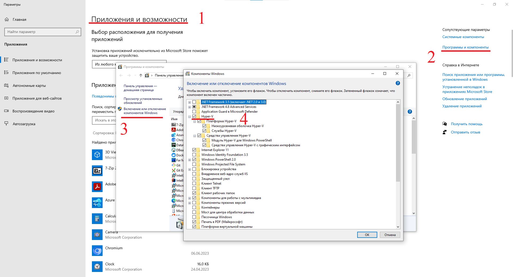
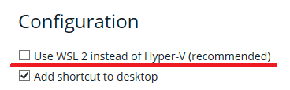

# Руководство по развертыванию приложения Pro-Legacy

## Предварительные требования

- Установленный Docker на вашей системе
- Стабильное подключение к интернету

---

## Рекомендации по установке Docker на Windows 10

На Windows 10 настоятельно рекомендуется использовать Hyper-V вместо WLS.

1. Чтобы включить Hyper-V, необходимо поставить галочку
   напротив соответствующего пунка, как это показано на скриншоте.

   

2. Во время установки Docker Desktop необходимо выбрать соответсвующую настройку

   

---

## Шаг 0: Конфигурация

Все инструкции выполняются из каталога `install`

В файле .env неоходимо указать:<br>
`REST_IP` - IP-адрес устройства, на котором развёрнут сервер. Не `localhost` если клиент и сервер находятся на разных
устройствах. Например `10.8.0.2`, <br>
`API_URL` - адрес, на который будет отправляться POST-запрос с файлом изображения,
приложенного обучающимся. Например: `http://10.8.0.2:10240/check`

---

## Шаг 1: Сборка и запуск Docker-контейнеров

До начала развёртывания необходимо положить в каталог `data` файл `features.json` и каталог `lessons`.
Правильная файловая структура должна выглядеть примерно так:

- install
    - data
        - features.json
        - lessons
            - topic.json
            - traits.json
            - lsn0001
                - ...
            - ...
    - .env
    - images.tar
    - ...

**Windows**

```bash
run_from_images.bat
```

Не закрывайте консоль до окончания работы с приложением.

В случае ошибки попробуйте ещё раз.

## Шаг 2: Доступ к приложению

После запуска контейнеров вы сможете получить доступ к приложению Pro-Legacy с помощью вашего веб-браузера по
адресу `http://<REST_URL>:4963`.

---

## Шаг 3: Остановка приложения

Чтобы остановить приложение и завершить работу контейнеров, закройте терминал или используйте сочитание CTRL+C.

---
